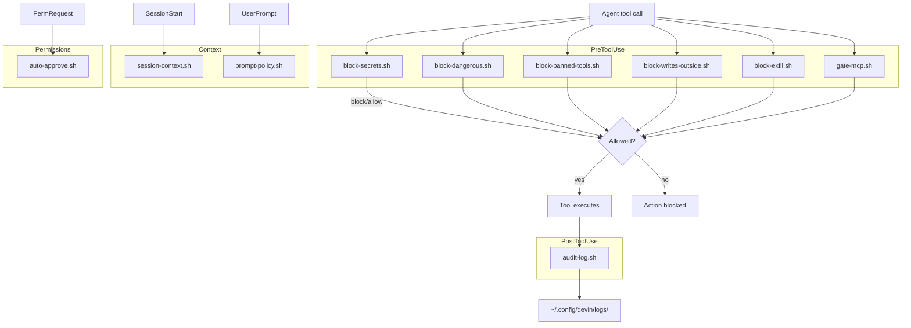

# devin-config

Global Devin CLI configuration: hooks, rules, slash commands, and templates.

## Problem

Devin CLI is powerful but ships with no guardrails by default. Without
enforcement, an AI agent can read secrets (`.env`, SSH keys), run destructive
commands (`sudo`, `rm -rf /`, `git push --force`), exfiltrate data
(`curl -X POST`), write outside the project dir, or use banned tools (`pip`,
`npm` instead of `uv`, `bun`). This repo packages all of those guardrails into
a single installable config so every Devin session is safe by default.

## Tags

`devin` `devin-cli` `ai-safety` `guardrails` `hooks` `security` `automation` `agent-safety` `cli-config`

## Architecture



## Getting Started

```bash
# Clone
git clone https://github.com/CodeWithBehnam/devin-config.git
cd devin-config

# Install everything (hooks, rules, commands, templates)
./install.sh

# Start a new Devin session to activate
devin
```

## What's included

### Hook scripts (12)

| Script | Event | What it does |
|--------|-------|-------------|
| `block-secrets.sh` | PreToolUse | Blocks reads of `.env`, SSH keys, credential files, `env`/`printenv` |
| `block-dangerous.sh` | PreToolUse | Blocks force-push, reset --hard, sudo, rm -rf outside repo, DROP TABLE, curl\|sh |
| `block-banned-tools.sh` | PreToolUse | Blocks `pip`, `npm`, `pnpm`, `yarn`, bare `python3` — enforces `uv` and `bun` |
| `block-writes-outside.sh` | PreToolUse | Blocks writes outside `DEVIN_PROJECT_DIR` (except `/tmp`) |
| `block-exfil.sh` | PreToolUse | Blocks curl/wget POST/PUT/data-upload, nc/socat, long webfetch URLs |
| `gate-mcp.sh` | PreToolUse | Blocks MCP tools with write verbs (create/update/delete/send/interact) |
| `block-ai-slop.sh` | PostToolUse | Blocks AI slop patterns (delve, leverage, foster, robust, etc.) in written content |
| `block-em-dashes.sh` | PreToolUse | Blocks em-dashes and en-dashes in writes, edits, and shell commands |
| `audit-log.sh` | PostToolUse | Logs every exec/write/edit to `~/.config/devin/logs/` |
| `session-context.sh` | SessionStart | Injects guardrail summary at session start |
| `prompt-policy.sh` | UserPromptSubmit | Injects policy reminder on every prompt |
| `auto-approve.sh` | PermissionRequest | Auto-approves safe read-only commands (git status, ls, npm test) |

### Rules (`AGENTS.md`)

Global user-level rules loaded in every session:
- Conventional commit format
- Functional/declarative code style
- Python: `uv` (Astral) only — `ruff`, `ty`, `vulture` for linting
- JS/TS: `bun` only — never `npm`/`pnpm`/`yarn`
- New repo setup: MIT license, README with mermaid + project tree, issue templates, CI workflows

### Slash commands (9)

Adapted from [data-goblin/claude-code-useful-slash-commands](https://github.com/data-goblin/claude-code-useful-slash-commands):

`/add-mcp-server`, `/analyze-git-history`, `/create-pull-request`, `/explain-code`,
`/review-recent-changes`, `/setup-github-repo`, `/update-readme`,
`/visualize-code-flow`, `/work-on-issue`

### Skills

| Skill | What it does |
|-------|-------------|
| `no-ai-slop` | Removes AI slop patterns from writing while preserving voice. Use with `/no-ai-slop` |

### Templates

- `LICENSE` — MIT license template
- `README.md` — README template with problem statement, tags, mermaid, project tree
- `.github/ISSUE_TEMPLATE/` — bug report + feature request templates
- `.github/workflows/lint.yml` — CI lint workflow (ruff + ty + vulture)
- `.github/workflows/test.yml` — CI test workflow (pytest --cov)

## Project Structure

```
devin-config/
├── AGENTS.md                          # Global user-level rules
├── HOOKS.md                           # Hook documentation
├── LICENSE                            # MIT license
├── README.md                          # This file
├── config.json                        # Hooks config (merged into ~/.config/devin/config.json)
├── install.sh                         # Installation script
├── scripts/                           # Hook scripts (10)
│   ├── audit-log.sh
│   ├── block-ai-slop.sh
│   ├── auto-approve.sh
│   ├── block-banned-tools.sh
│   ├── block-dangerous.sh
│   ├── block-em-dashes.sh
│   ├── block-exfil.sh
│   ├── block-secrets.sh
│   ├── block-writes-outside.sh
│   ├── gate-mcp.sh
│   ├── prompt-policy.sh
│   └── session-context.sh
├── commands/                          # Slash commands (9)
│   ├── add-mcp-server.md
│   ├── analyze-git-history.md
│   ├── create-pull-request.md
│   ├── explain-code.md
│   ├── review-recent-changes.md
│   ├── setup-github-repo.md
│   ├── update-readme.md
│   ├── visualize-code-flow.md
│   └── work-on-issue.md
├── skills/
│   └── no-ai-slop/
│       ├── SKILL.md
│       └── eval.md
└── templates/                         # Repo scaffolding templates
    ├── LICENSE
    ├── README.md
    └── .github/
        ├── ISSUE_TEMPLATE/
        │   ├── bug_report.md
        │   └── feature_request.md
        └── workflows/
            ├── lint.yml
            └── test.yml
```

## Install locations

| Source | Destination |
|--------|-------------|
| `config.json` (hooks key) | merged into `~/.config/devin/config.json` |
| `scripts/*.sh` | `~/.config/devin/scripts/` |
| `AGENTS.md` | `~/.config/devin/AGENTS.md` |
| `HOOKS.md` | `~/.config/devin/HOOKS.md` |
| `templates/*` | `~/.config/devin/templates/` |
| `commands/*.md` | `~/.claude/commands/` |
| `skills/*` | `~/.config/devin/skills/` |

## Verify

After installation, run `/hooks` in a Devin session to see all loaded hooks.

## License

MIT — see [LICENSE](LICENSE).
