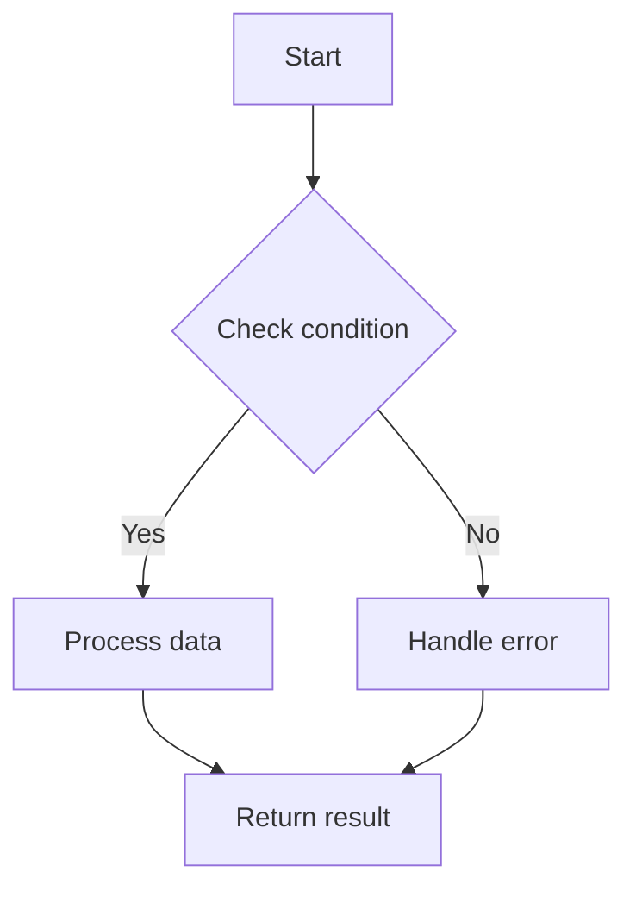
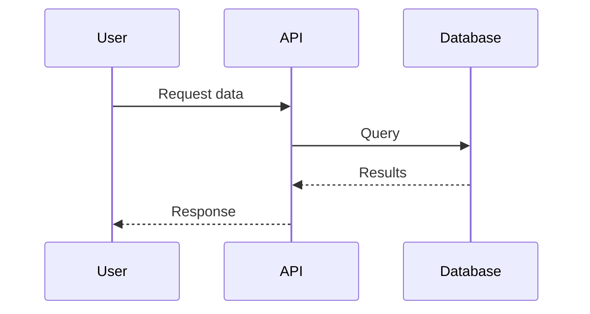
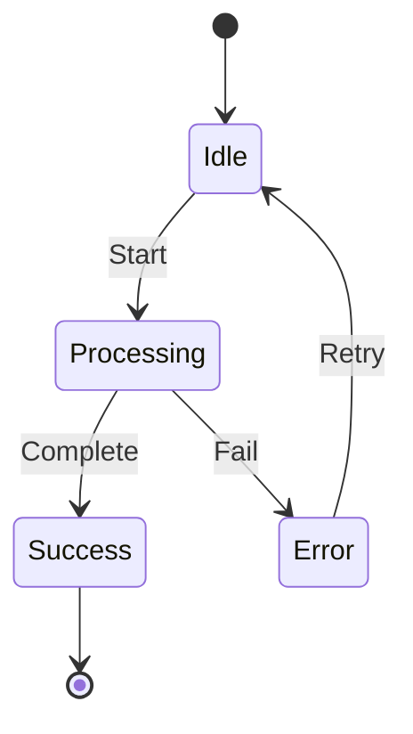

Create a visual diagram showing how the code in $ARGUMENTS works.

# ANALYZE CODE

Code to visualize:
@$ARGUMENTS

# UNDERSTAND FLOW

1. Identify the main components:
   - Entry points (main functions, exports, APIs)
   - Key functions and their relationships
   - Data flow between components
   - Decision points and branches
   - External dependencies or integrations

2. Determine best diagram type:
   - Sequence diagram: For time-based interactions
   - Flowchart: For decision logic and processes
   - Component diagram: For system architecture
   - State diagram: For state machines

# CREATE VISUALIZATION

1. Write a clear, concise description of what the code does

2. Create appropriate Mermaid diagram based on code structure

3. Save as `$ARGUMENTS-visualization.md` with:
   ```markdown
   # Code Visualization: [filename]
   
   ## Overview
   [Brief description of what this code does]
   
   ## Flow Diagram
   ```mermaid
   [Appropriate diagram here]
   ```
   
   ## Key Components
   - [List main functions/classes and their purposes]
   
   ## Usage Example
   [How someone would typically use this code]
   ```

# DIAGRAM EXAMPLES

For decision flow:


For sequence flow:


For state machines:
