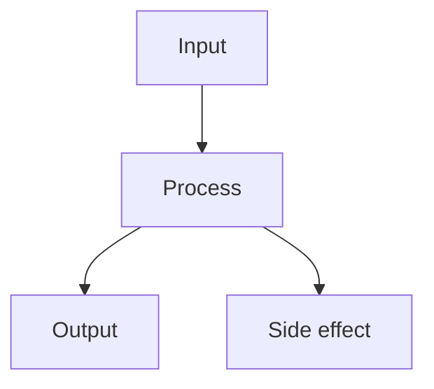

# {project-name}

{one-line description}

## Problem

{What problem does this repo solve? Why does it exist? Describe the pain
point or gap this project addresses.}

## Tags

`tag1` `tag2` `tag3` `tag4`

## Architecture



## Getting Started

```bash
# Clone
git clone https://github.com/{user}/{repo}.git
cd {repo}

# Install dependencies
uv sync  # Python
# or
bun install  # JS/TS

# Run
uv run main.py  # Python
# or
bun src/index.ts  # JS/TS
```

## Project Structure

```
{repo}/
├── src/
│   └── ...
├── tests/
│   └── ...
├── .github/
│   ├── workflows/
│   │   ├── lint.yml
│   │   └── test.yml
│   └── ISSUE_TEMPLATE/
│       ├── bug_report.md
│       └── feature_request.md
├── pyproject.toml  # or package.json
├── LICENSE
└── README.md
```

## License

MIT — see [LICENSE](LICENSE).
